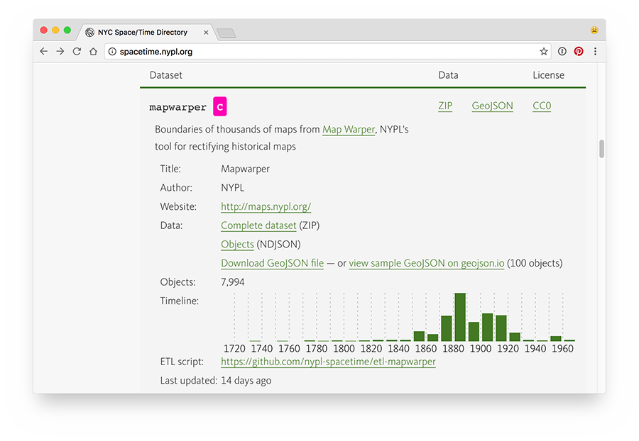
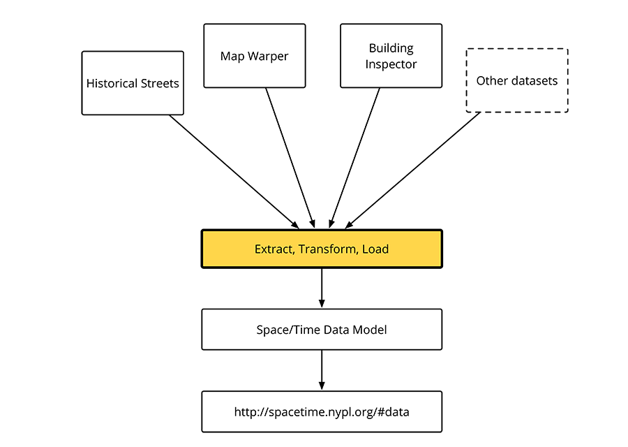
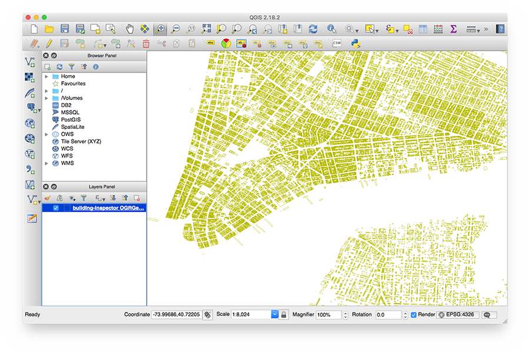
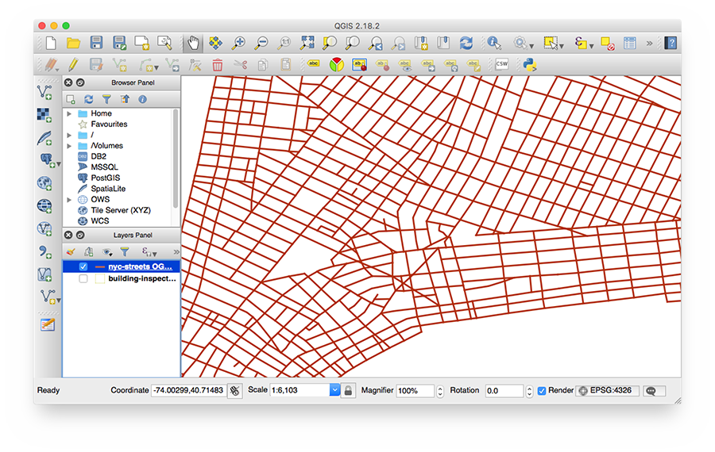
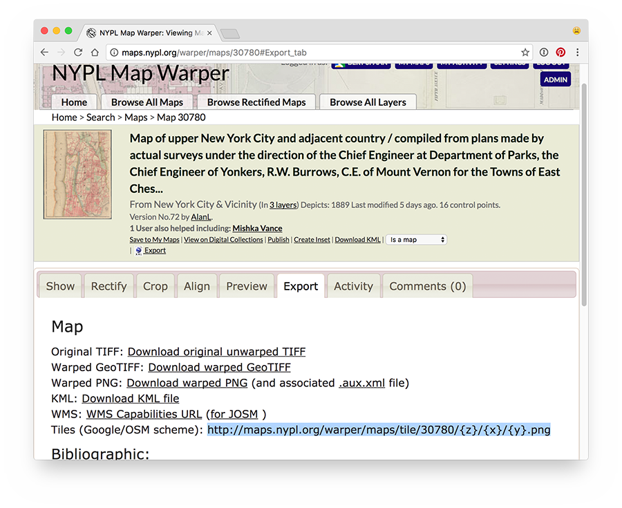
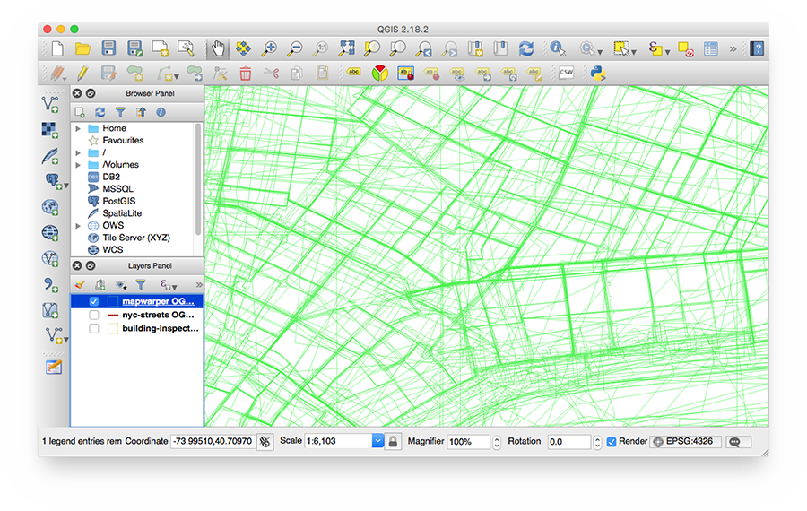

# Tutorial: Historical Addresses & NYC Space/Time Directory

This is a tutorial made for the second meetup of [NYC Space/Time Directory](http://spacetime.nypl.org)'s [meetup series](https://www.meetup.com/historical-data-and-maps-at-nypl/): [NYC Maps, Buildings, and Addresses: Using and combining historic data](https://www.meetup.com/historical-data-and-maps-at-nypl/events/236221289/) on February 1st, 2017.

in this tutorial, we will combine two different crowdsourced datasets from the NYC Space/Time Directory to create a web interface makes historical addresses searchable and visible.

Datasets:

- [__Building Inspector__](http://buildinginspector.nypl.org/):
  - NYPL's tool for crowdsourced extraction of historical building footprints and addresses from historical maps
  - Dataset: http://spacetime.nypl.org/#data-building-inspector
- [__Historical streets__](http://mgiraldo.github.io/centerlines/):
  - Street polylines traced from historical maps & atlases
  - Dataset: http://spacetime.nypl.org/#data-nyc-streets
- [__Map Warper__](http://maps.nypl.org/warper):
  - Tool for crowdsourced georectification of historic maps
  - Dataset: http://spacetime.nypl.org/#data-mapwarper

## Outline

In this tutorial, we will do the following things:

1. See what data is available via [Building Inspector's API](http://buildinginspector.nypl.org/data)
2. Find out how the NYPL traces the locations and names of streets from historical maps, and turns this into new datasets for everyone to use (and how you can help tracing more maps)
3. We will use the NYC Space/Time Directory's website to download and use those datasets
4. Combine Building Inspector and historical street datasets to create a new dataset containing historical addresses
5. We'll use Leaflet to display Map Warper's historical map tiles
6. And finally, put everything together and make our new dataset searchable with a simple web interface

__Examples__ from a [1854 New York City Directory](https://digitalcollections.nypl.org/collections/new-york-city-directory-for-1854-1855-thirteenth-publication#/?tab=navigation):

- _Kelly William E. daguerreotypes, 374 Bowery_


This address on 1875 map:


- _Palmer George, painter, 90 Nassau, h. 84½ Fulton, Brooklyn_


This address on 1855 map:


__Goal__: web interface for searching historical addresses


## Data

In this tutorial, we're using data from one of NYPL's crowdsourcing tools (Building Inspector), one crowdsourced dataset (historical streets), and we'll use Map Warper to display historical map tiles. Traditionally, we would have needed to manually download data from the Building Inspector API (more information [below](#building-inspector)), use [Shapefiles](https://en.wikipedia.org/wiki/Shapefile) from the streets dataset, and combine those datasets together ourselves.

__Not anymore!__

Using the NYC Space/Time Directory, all this data is available __in one format, in one place__. (Later this year, I will add new search and map interfaces to make finding, visualizing and using all this data easier — like the one we will make in this tutorial, but for _all_ NYPL's geospatial data.)

You can find NYC Space/Time Directory datasets here: [spacetime.nypl.org#data](http://spacetime.nypl.org#data).



## Extract, Transform, Load

Data does not magically convert itself to one data model and appear on the NYC Space/Time Directory website. For the project, I have written many [extract, transform, load](https://en.wikipedia.org/wiki/Extract,_transform,_load) (ETL) modules which take data from one place, transform it, and output Space/Time data.



## Using data from the command line

Space/Time datasets consist of one or more [Newline Delimited JSON](http://ndjson.org/) (NDJSON) files, and a JSON file with dataset metadata (title, author, license, etc.). NDJSON files contain one JSON object per line, which is convenient when using command line tools, or when doing streaming data processing.

Let's have a look at one line from `building-inspector.objects.ndjson`:

```json
{"id":"87139-1","type":"st:Address","validSince":1857,"validUntil":1857,"name":"20","data":{"number":"20","sheetId":177,"layerId":859,"mapId":7138},"geometry":{"type":"Point","coordinates":[-73.99559810757634,40.71142649628733]}}
```

This line contains _one address_ from Building Inspector's API, transcribed with crowdsourcing, and converted to the [Space/Time data model](https://github.com/nypl-spacetime/ontology). Please note that address only contains a house number, no street name.

The same object, but on multiple lines and easier to read:

```json
{
   "id":"87139-1",
   "type":"st:Address",
   "validSince":1857,
   "validUntil":1857,
   "name":"20",
   "data":{
      "number":"20",
      "sheetId":177,
      "layerId":859,
      "mapId":7138
   },
   "geometry":{
      "type":"Point",
      "coordinates":[
         -73.99559810757634,
         40.71142649628733
      ]
   }
}
```

It's easy to process those files using your command line. The examples below use the following tools:

- [jq](https://stedolan.github.io/jq/): command-line JSON processor, install with `brew install jq`
- [ndjson-cli](https://github.com/mbostock/ndjson-cli): command-line tools for operating on newline-delimited JSON streams, install with `npm install -g ndjson-cli`
- [spacetime-cli](https://github.com/nypl-spacetime/spacetime-cli): command-line tools for Space/Time data, install with `npm install -g nypl-spacetime/spacetime-cli`

Use ndjson-filter to filter Building Inspector data by year, convert to GeoJSON, and save the resulting file to disk:

```
curl http://s3.amazonaws.com/spacetime-nypl-org/\
datasets/building-inspector/building-inspector.objects.ndjson \
| ndjson-filter 'd.validSince > 1880' | spacetime-to-geojson > \
~/Downloads/building-inspector-1880.geojson
```

Use ndjson-map to only display the ID and the name, and then grep for _Harlem_:

```
curl http://s3.amazonaws.com/spacetime-nypl-org/\
datasets/mapwarper/mapwarper.objects.ndjson \
| ndjson-map '`${d.id} - ${d.name}`' | grep Harlem
```

For more information and examples, see https://github.com/nypl-spacetime/spacetime-data/

## Using GeoJSON files directly

If you're just interested in geospatial data, you can download GeoJSON files directly from [spacetime.nypl.org](http://spacetime.nypl.org/#data).

These GeoJSON files can be used in any GIS tool. And you can easily display and edit them using [geojson.io](http://geojson.io/):

- [New York City's churches](http://geojson.io/#data=data:text/x-url,http%3A%2F%2Fs3.amazonaws.com%2Fspacetime-nypl-org%2Fdatasets%2Fnyc-churches%nyc-churches.geojson)
- [A sample of 100 (of almost 40,000) photos from OldNYC](http://geojson.io/#data=data:text/x-url,http%3A%2F%2Fs3.amazonaws.com%2Fspacetime-nypl-org%2Fdatasets%2Foldnyc%2Foldnyc.sample.geojson)

## Building Inspector

The Building Inspector dataset contains two types of objects:

- __Buildings: footprints of historical buildings__, with year, map layer, and color
- __Addresses: transcibed house numbers__ (see Building Inspector's [_Enter Addresses_ task](http://buildinginspector.nypl.org/address)), with year, map layer and coordinates

(In the dataset's ZIP file you will find `building-inspector.relations.ndjson`, which contains links between buildings and addresses, but we will not use those in this tutorial.)

You can use [QGIS](http://www.qgis.org/) to display GeoJSON files:



## Historical Streets

The historical streets dataset (`nyc-streets`) contains one type of objects:

- __Streets: centerlines of historical streets__, with their name, year and map layer

The tracing of streets from historic maps is done manually, in QGIS. __You can help us, see https://github.com/nypl-spacetime/qgis-trace-tutorial for details.__



# Map Warper

In this tutorial, we won't use data from Space/Time `mapwarper` dataset (which contains the polygonal outlines and metadata of thousands of NYC maps), but we will use Map Warper's tile server to display historical map tiles.

Building Inspector's addresses contain the ID of the map that was used for address transcription. On the [_Export_ tab](http://maps.nypl.org/warper/maps/30780#Export_tab) in Map Warper's map view, you can see that map's [tiles URL](https://en.wikipedia.org/wiki/Tile_Map_Service):

    http://maps.nypl.org/warper/maps/tile/30780/{z}/{x}/{y}.png



You can use this tile URL in many geospatial tools, including [Leaflet](http://leafletjs.com/reference-1.0.3.html#tilelayer):

```js
L.tileLayer('http://maps.nypl.org/warper/maps/tile/30780/{z}/{x}/{y}.png').addTo(map)
```

Although this tutorial does not use Map Warper data directly, you can still have a look at the dataset's GeoJSON file, or even open it in QGIS:



## Finding closest historical street for each Building Inspector address

We have, in two separate datasets, address and street data:

- `building-inspector` dataset: house numbers with point geometries
- `nyc-streets` dataset: street names with polyline geometries

We need a way to figure out that house number __84½__ belongs to __Fulton Street__ on the same map:


Luckily, buildings with house numbers are usually geographically close to the street they are on, so we can compute the distance between each address and each street, and we should find pretty good matches. Or course, we also want to take the year of both the address and the street into account, to that we will not link 1854 addresses to 1894 streets.

For the NYC Space/Time Directory, I have created an [ETL module](https://github.com/nypl-spacetime/etl-building-inspector-nyc-streets
) which uses [PostGIS](http://www.postgis.net/) and data from the `building-inspector` and `nyc-streets` datasets to create links between those datasets.

Example SQL query from this ETL module, using a 5 year margin for matching addresses and streets:

```sql
SELECT addresses.id, (
  SELECT
    streets.id
  FROM objects streets
  WHERE type = 'st:Street' AND
    lower(streets.validsince) - interval '5 year' < lower(addresses.validsince) AND
    upper(streets.validuntil) + interval '5 year' > upper(addresses.validuntil) AND
    ST_Distance(Geography(addresses.geometry), Geography(streets.geometry)) < 20 -- meters
  ORDER BY ST_Distance(addresses.geometry, streets.geometry)
  LIMIT 1
) AS streets
FROM objects addresses
WHERE type = 'st:Address'
```

See [GitHub](https://github.com/nypl-spacetime/etl-building-inspector-nyc-streets) for the source code of the ETL module.

See [bertspaan.nl/west-village](http://bertspaan.nl/west-village) for more details about matching addresses and streets using PostGIS.

The resulting dataset is called `building-inspector-nyc-streets` and can be found on the [Space/Time website](http://spacetime.nypl.org/#data-building-inspector-nyc-streets).

Example GeoJSON from resulting datasets, with links between Building Inspector and `nyc-streets`:

```json
{
  "type": "Feature",
  "properties": {
    "id": "78675-1",
    "name": "119 East 59th Street",
    "type": "st:Address",
    "validSince": 1857,
    "validUntil": 1858,
    "data": {
      "mapId": 7113,
      "number": "119",
      "layerId": 859,
      "sheetId": 152,
      "addressId": "building-inspector/78675-1",
      "streetId": "nyc-streets/859-east-59th-street"
    }
  },
  "geometry": {
    "type": "Point",
    "coordinates": [
      -73.965545,
      40.761191
    ]
  }
}
```

Open a [sample of 100 addresses in geojson.io](http://geojson.io/#data=data:text/x-url,http%3A%2F%2Fs3.amazonaws.com%2Fspacetime-nypl-org%2Fdatasets%2Fbuilding-inspector-nyc-streets%2Fbuilding-inspector-nyc-streets.sample.geojson).

## Preparing data for a web interface

The Objects NDJSON file of `building-inspector-nyc-streets`, the dataset we've explained in the previous section, is more than 13MB and contains many fields (like IDs and types) we do not need in our visualization.

This tutorial contains a [small Node.js script](data.js) which downloads `building-inspector-nyc-streets` and `nyc-steets` from the Space/Time website, removes some unneeded fields out and does some data transformation to index streets by their ID. Yet another ETL step, it never ends.

In many of Space/Time's ETL tools I'm using on [Highland](http://highlandjs.org/) for streaming data processing. Highland is great, you should use it too!

To run this script, first install its dependencies:

    npm install

Then, run the script:

    node data.js

The resulting [addresses json file](data/addresses.json) has now shrunk 50% in size to 7.1MB, and around 700KB with [HTTP compression](https://en.wikipedia.org/wiki/HTTP_compression).

## Web interface

Now, we have all data we need:

  - A new dataset with historical addresses (with street names), including their locations
  - For every address, a links to the geometry of it's street
  - A way to display historic map tiles from Map Warper

With some HTML, JavaScript and CSS, it's pretty easy to make a website with which you can search those historical addresses.

Some libraries we'll need:

  - [__D3.js__](https://d3js.org/): D3.js is a JavaScript library for manipulating documents based on data. It makes downloading JSON data and then modifying the webpage based on this data very easy.
  - [__Leaflet__](http://leafletjs.com/):  Leaflet is a JavaScript library for mobile-friendly interactive maps. It can display Map Warper's map tiles, as well as GeoJSON data.
  - [__lunr.js__](http://lunrjs.com/): lunr.js is a simple full text search engine for the browser. We use lunr.js to index and search addresses.

Our search tool consists of three files:

  - [`index.html`](index.html)
  - [`js/historical-addresses.js`](js/historical-addresses.js)
  - [`css/style.css`](css/style.css)

`index.html` is the page that opens when you point your browser to [bertspaan.nl/tutorial-historical-addresses](http://bertspaan.nl/tutorial-historical-addresses/).

Below, I will explain the most important parts of [`js/historical-addresses.js`](js/historical-addresses.js):

First, initialize a Leaflet map, and add three layers:

  1. An OpenStreetMap base layer
  2. A tile layer for Map Warper tiles
  3. A GeoJSON layer for address and street data

```js
var map = L.map('map', {
  center: [40.8, -73.96],
  zoom: 14,
  maxZoom: 20
})

var baseMapTileUrl = 'http://{s}.tile.openstreetmap.org/{z}/{x}/{y}.png'
var baseLayer = L.tileLayer(baseMapTileUrl, {
  attribution: '&copy; <a href="http://www.openstreetmap.org/copyright">OpenStreetMap</a> contributors',
  maxZoom: 20,
  maxNativeZoom: 19
}).addTo(map)

var tileLayer = L.tileLayer('', {
  maxZoom: 20
}).addTo(map)

var geojsonLayer = new L.geoJson(null, {
  style: styles.street,
  pointToLayer: function (feature, latlng) {
    return L.circleMarker(latlng, styles.address)
  },
  onEachFeature: function (feature, layer) {
    var text = feature.properties.name || feature.properties.address
    if (text) {
      layer.bindPopup(text)
    }
  }
}).addTo(map)
```

Create a new lunr.js index, indexing only the `address` field and using `id` as a reference:

```js
var idx = lunr(function () {
  this.field('address')
  this.ref('id')
})
```

Use D3.js to load the two JSON files, store the data, and index all addresses with lunr.js:

```js
d3.json('data/streets.json', function (json) {
  streets = json
})

d3.json('data/addresses.json', function (json) {
  addresses = json

  addresses.forEach(function (address) {
    idx.add(address)
  })
})
```

When the user types in the input field, search the lunr.js index, take only the first 75 results, and store them for display:

```js
d3.select('#search')
  .on('input', function () {
    var results = idx.search(this.value)
      .slice(0, 75)
      .map(function (result) {
        return addresses[result.ref]
      })
  })
```

After searching and finding a new address, the map will move to the coordinates of that address. When the map is finished moving, set the tile URL of the tile layer to the correct Map Warper tile URL:

```js
map.on('moveend', function () {
  var tileUrl = 'http://maps.nypl.org/warper/maps/tile/' + selectedAddress.mapId + '/{z}/{x}/{y}.png'
  tileLayer.setUrl(tileUrl)
})
```

__Final result:__ [bertspaan.nl/tutorial-historical-addresses](http://bertspaan.nl/tutorial-historical-addresses)

[](http://bertspaan.nl/tutorial-historical-addresses)
