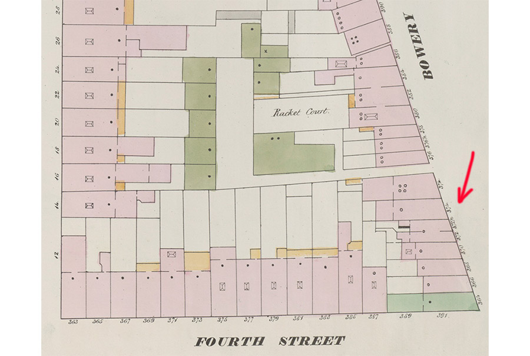

# Tutorial: Historical Addresses & NYC Space/Time Directory

THis is a tutorial made for the second meetup of [NYC Space/Time Directory](http://spacetime.nypl.org)'s [meetup series](https://www.meetup.com/historical-data-and-maps-at-nypl/): [NYC Maps, Buildings, and Addresses: Using and combining historic data](https://www.meetup.com/historical-data-and-maps-at-nypl/events/236221289/) on February 1st, 2017.

in this tutorial, we will combine two different crowdsourced datasets from the NYC Space/Time Directory to create a web interface makes historical addresses searchable and visible.

Datasets:

- [__Building Inspector__](http://buildinginspector.nypl.org/):
  - NYPL's tool for crowdsourced extraction of historical building footprints and addresses from historical maps
  - Dataset: http://spacetime.nypl.org/#data-building-inspector
- [__Historical streets__](http://mgiraldo.github.io/centerlines/):
  - Street polylines traced from historical maps & atlases
  - Dataset: http://spacetime.nypl.org/#data-nyc-streets
- [__Map Warper__](http://maps.nypl.org/warper):
  - Tool for crowdsourced georectification of historic maps
  - Dataset: http://spacetime.nypl.org/#data-mapwarper

## Outline

In this tutorial, we will do the following things:

- See what data is available via [Building Inspector's API](http://buildinginspector.nypl.org/data)
- Find out how the NYPL traces the locations and names of streets from historical maps, and turns this into new datasets for everyone to use (and how you can help tracing more maps)
- We will use the NYC Space/Time Directory's website to download and use those datasets
- Combine Building Inspector and historical street datasets to create a new dataset containing historical addresses
- We'll use Leaflet to display Map Warper's historical map tiles
- And finally, put everything together and make our new dataset searchable with a simple web interface

__Examples__ from [1854 New York City Directory](https://digitalcollections.nypl.org/collections/new-york-city-directory-for-1854-1855-thirteenth-publication#/?tab=navigation):

- _Kelly William E. daguerreotypes, 374 Bowery_


This address on 1875 map:



- _Palmer George, painter, 90 Nassau, h. 84½ Fulton, Brooklyn_


This address on 1855 map:


__Goal__: web interface for searching historical addresses


## Data

In this tutorial, we're using data from one of NYPL's crowdsourcing tools (Building Inspector), one crowdsourced dataset (historical streets), and we'll use Map Warper to display historical map tiles. Traditionally, we would have needed to manually download data from the Building Inspector API (more information [below](#building-inspector)), use [Shapefiles](https://en.wikipedia.org/wiki/Shapefile) from the streets dataset, and combine those datasets together ourselves.

__Not anymore!__

Using the NYC Space/Time Directory, all this data is available __in one format, in one place__. (Later this year, I will add new search and map interfaces to make finding, visualizing and using all this data easier — like the one we will make in this tutorial, but for _all_ NYPL's geospatial data.)

You can find NYC Space/Time Directory datasets here: [spacetime.nypl.org#data](http://spacetime.nypl.org#data).


## Extract, Transform, Load

Data does not magically convert itself to one data model and appear on the NYC Space/Time Directory website. For the project, I have written many [extract, transform, load](https://en.wikipedia.org/wiki/Extract,_transform,_load) (ETL) modules which take data from one place, transform it, and output Space/Time data.


https://github.com/nypl-spacetime?utf8=%E2%9C%93&q=etl-&type=&language=

## Using data from the command line

http://ndjson.org/

Newline Delimited JSON

NDJSON

```json
{"id":"87139-1","type":"st:Address","validSince":1857,"validUntil":1857,"name":"20","data":{"number":"20","sheetId":177,"layerId":859,"mapId":7138},"geometry":{"type":"Point","coordinates":[-73.99559810757634,40.71142649628733]}}
```

```json
{
   "id":"87139-1",
   "type":"st:Address",
   "validSince":1857,
   "validUntil":1857,
   "name":"20",
   "data":{
      "number":"20",
      "sheetId":177,
      "layerId":859,
      "mapId":7138
   },
   "geometry":{
      "type":"Point",
      "coordinates":[
         -73.99559810757634,
         40.71142649628733
      ]
   }
}
```

The examples below use the following tools:

- [jq](https://stedolan.github.io/jq/): command-line JSON processor, install with `brew install jq`
- [ndjson-cli](https://github.com/mbostock/ndjson-cli): command-line tools for operating on newline-delimited JSON streams, install with `npm install -g ndjson-cli`
- [spacetime-cli](https://github.com/nypl-spacetime/spacetime-cli): command-line tools for Space/Time data, install with `npm install -g nypl-spacetime/spacetime-cli`

Use ndjson-filter to filter Building Inspector data by year, and save the resulting GeoJSON file to disk:

```
curl http://s3.amazonaws.com/spacetime-nypl-org/\
datasets/building-inspector/building-inspector.objects.ndjson \
| ndjson-filter 'd.validSince > 1880' | spacetime-to-geojson > \
~/Downloads/building-inspector-1880.geojson
```

Use ndjson-map to only display the ID and the name, and then grep for _Harlem_:

```
curl http://s3.amazonaws.com/spacetime-nypl-org/\
datasets/mapwarper/mapwarper.objects.ndjson \
| ndjson-map '`${d.id} - ${d.name}`' | grep Harlem
```

For more information and examples, see https://github.com/nypl-spacetime/spacetime-data/

## Using GeoJSON files directly

100 of almost 40,000 photos
http://geojson.io/#data=data:text/x-url,http%3A%2F%2Fs3.amazonaws.com%2Fspacetime-nypl-org%2Fdatasets%2Foldnyc%2Foldnyc.sample.geojson

http://s3.amazonaws.com/spacetime-nypl-org/datasets/nyc-churches/nyc-churches.geojson

## Building Inspector


BI: puntlocaties van addresses, alleen huisnummer, géén straatnaam
straatnamen in `nyc-streets`

point to dataset, example in geojson.io

## Historical Streets

nyc-streets

  - manual tracing of atlases, point to tutorial
  point to dataset, example in geojson.io

## Finding closest historical street for each Building Inspector address

For each address, find right street (+/- 5 years), see bertspaan.nl/west-village
see etl-building-inspector-nyc-streets
postgis, indexed distance

show SQL

```sql
SELECT addresses.id, (
  SELECT
    streets.id
  FROM objects streets
  WHERE type = 'st:Street' AND
    lower(streets.validsince) - interval '5 year' < lower(addresses.validsince) AND
    upper(streets.validuntil) + interval '5 year' > upper(addresses.validuntil) AND
    ST_Distance(Geography(addresses.geometry), Geography(streets.geometry)) < 20 -- meters
  ORDER BY ST_Distance(addresses.geometry, streets.geometry)
  LIMIT 1
) AS streets
FROM objects addresses
WHERE type = 'st:Address'
```

resultaat: de dataset op S/t, voorbeeld etc.
geojson.io

## Preparing data for web interface

data.js

npm install

node data.js

7.1MB, 700KB with gzip


## Web interface

overal links naar #line

Initialize Leaflet map

```js
var map = L.map('map', {
  center: [40.8, -73.96],
  zoom: 14,
  maxZoom: 20
})

var baseMapTileUrl = 'http://{s}.tile.openstreetmap.org/{z}/{x}/{y}.png'
var baseLayer = L.tileLayer(baseMapTileUrl, {
  attribution: '&copy; <a href="http://www.openstreetmap.org/copyright">OpenStreetMap</a> contributors',
  maxZoom: 20,
  maxNativeZoom: 19
}).addTo(map)

var tileLayer = L.tileLayer('', {
  maxZoom: 20
}).addTo(map)

var geojsonLayer = new L.geoJson(null, {
  style: styles.street,
  pointToLayer: function (feature, latlng) {
    return L.circleMarker(latlng, styles.address)
  },
  onEachFeature: function (feature, layer) {
    var text = feature.properties.name || feature.properties.address
    if (text) {
      layer.bindPopup(text)
    }
  }
}).addTo(map)
```


```js
var idx = lunr(function () {
  this.field('address')
  this.ref('id')
})
```

Use D3.js to load the two JSON files, and index all addresses with Lunr.js

```js
d3.json('data/streets.json', function (json) {
  streets = json
})

d3.json('data/addresses.json', function (json) {
  addresses = json

  addresses.forEach(function (address) {
    idx.add(address)
  })
})
```

```js
d3.select('#search')
  .on('input', function () {
    var results = idx.search(this.value)
      .slice(0, 75)
      .map(function (result) {
        return addresses[result.ref]
      })
  })
```


```js
map.on('moveend', function () {
  var tileUrl = 'http://maps.nypl.org/warper/maps/tile/' + selectedAddress.mapId + '/{z}/{x}/{y}.png'
  tileLayer.setUrl(tileUrl)
})
```

address, from map warper, contains a `mapId`

maps.nypl.org/warper/maps/11982
http://maps.nypl.org/warper/maps/11982#Export_tab

http://maps.nypl.org/warper/maps/tile/11982/{z}/{x}/{y}.png


